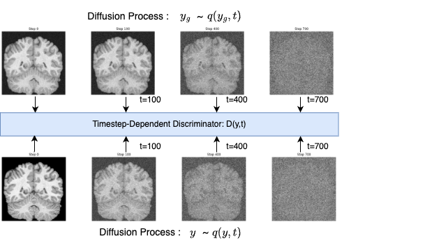
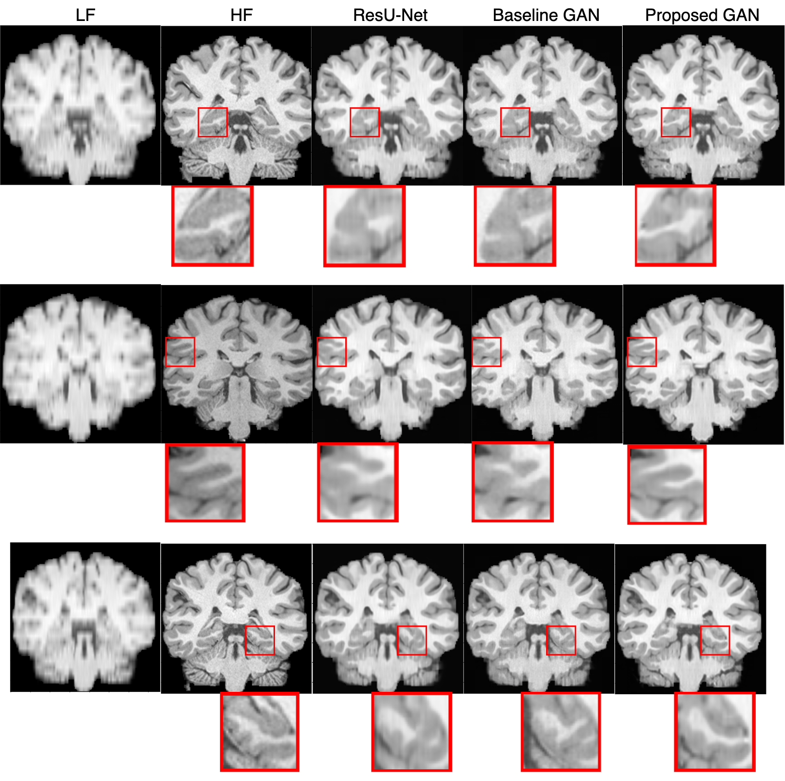
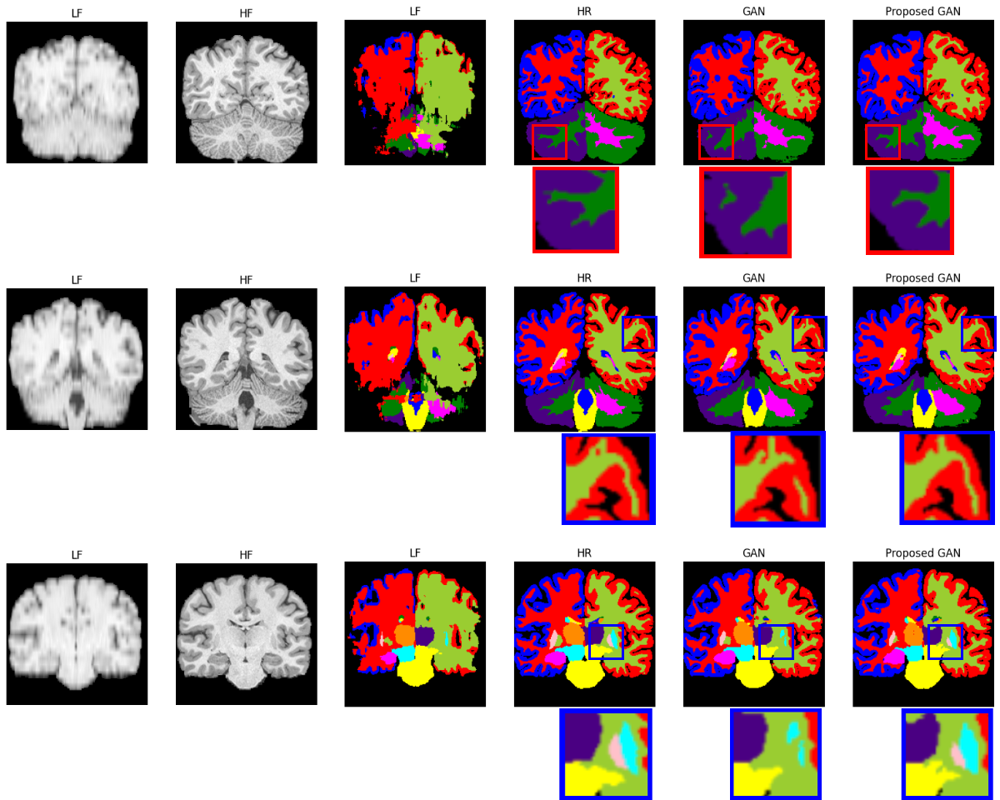

<h1>UCL FYP(Thesis)</h1>
<h1>Improving Image Quality Transfer(IQT) with 3D Diffusion-Generative Adversarial Networks: An Application to Low Field MRI.
</h1>

<h2>Abstract</h2>
Magnetic Resonance Imaging (MRI) is a crucial tool for medical diagnostics and clinical management, providing detailed information about the internal structure and function of the human body. However, a low signal-to-noise ratio (SNR) can negatively impact the quality of MR images, particularly in low-field (LF) MRI scanners with magnetic strengths lower than 1T. This limitation restricts the application of LF MRI scanners in various clinical settings and can result in suboptimal patient outcomes. To address this challenge, Image Quality Transfer (IQT) has been introduced, aiming to transfer information from high-resolution medical images to lower-resolution ones to improve image quality without requiring expensive high-field (HF) MRI scanners. This is particularly beneficial for low- and middle-income countries where access to high-quality MRI scanners is limited. The most recent IQT research focused on MSE-based approaches that decreased perceptual quality due to sole reliance on MAE or MSE loss. Recently, Generative Adversarial Networks (GAN) and diffusion models have gained popularity in image reconstruction, outperforming previous MSE-based approaches. Inspired by this, in this paper, we adopt a 3D diffusion-GAN to improve low-field MR images. Our model not only outperforms MSE-based approaches but also increases training stability and enhances data efficiency compared to vanilla GANs.

<h2>Main Architecture</h2>
Modified Discriminator for proposed Gan
<!-- #region -->

<!-- #endregion -->

<h2>Results</h2>
LF: Low Field, HF: High Field, ResU-Net, Gan (Generator: ResU-Net), Proposed Gan
<!-- #region -->

<!-- #endregion -->

<h2>Segmentation</h2>
<!-- #region -->

<!-- #endregion -->

